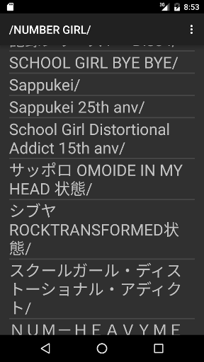

RuuMusic
========
ディレクトリをプレイリストとして使うAndroid用音楽プレイヤー。

## Description
メタデータを利用せず、ディレクトリをプレイリストとして使用する音楽プレイヤーです。
ファイラのような画面で音楽を選んで、再生することが出来ます。

[google play](https://play.google.com/store/apps/details?id=jp.blanktar.ruumusic)で安定板をインストールすることが出来ます。

## Screenshots

## Features
* ファイラのような画面で音楽を選べます。
	メタデータは使いません。単純です。
* 特定のディレクトリ以下を再帰的に再生出来ます。
* 同じ名前で複数の拡張子のファイルがある場合、一番良さそうなものだけを使います。
	複数のファイルがあっても拡張子を気にする必要がありません。
* bluetoothレシーバから操作出来ます。
* 通知エリアから操作出来ます。(Android 4.1以上)
* 音楽の検索が出来ます。
	検索結果をプレイリストとして再生することも出来ます。

## Author / License
[MIT License](http://opensource.org/licenses/mit-license.php) (c)2015 MacRat
