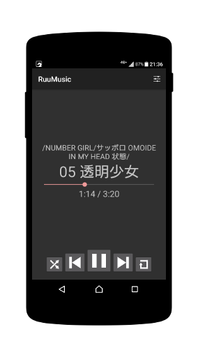

RuuMusic
========
ディレクトリをプレイリストとして使うAndroid用音楽プレイヤー。

## Description
メタデータを利用せず、ディレクトリをプレイリストとして使用する音楽プレイヤーです。
ファイラのような画面で音楽を選んで、再生することが出来ます。

[google play](https://play.google.com/store/apps/details?id=jp.blanktar.ruumusic)で安定板をインストールすることが出来ます。

## Screenshots

## Features
* ファイラのような画面で音楽を選べます。
	メタデータは使いません。単純です。
* 特定のディレクトリ以下を再帰的に再生出来ます。
* 同じ名前で複数の拡張子のファイルがある場合、一番良さそうなものだけを使います。
	複数のファイルがあっても拡張子を気にする必要がありません。
* グローバル検索（端末内検索）をサポートしています。(Android 4.4未満)
* bluetoothレシーバから操作出来ます。
* 通知エリアから操作出来ます。(Android 4.1以上)
* ロックスクリーンから操作出来ます。(Android 4.0以上)
* Android Wearから操作出来ます。
* Android Autoから操作出来ます。
* 一般的なスタイルのウィジェットに加え、再生/停止やスキップボタンなどに独立した小さなウィジェットが複数あります。
	欲しいものを組合せて使ってください。
* 音楽やディレクトリの検索が出来ます。
	検索結果をプレイリストとして再生することも出来ます。
* 音質の設定が出来ます。
	低音ブースト、リバーブ、イコライザー、ラウドネスエンハンサー（Android 4.4以上）など。
