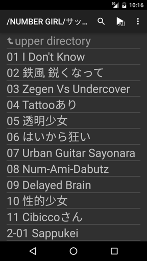

RuuMusic
========
The dirctory based music player for Android.

## Description
RuuMusic is directory based music player. You can choose music by a interface like filer, and play it.
RuuMusic doesn't use music file metadata. It uses only directory structure and file name.

You can install stable version from [google play](https://play.google.com/store/apps/details?id=jp.blanktar.ruumusic).

## Screenshots

## Features
* Selecting music by simple filer.
	RuuMusic doesn't use metadata.
* Play recursive under one directory.
* If there is multiple extension music files, RuuMusic will use most better one.
	User not have to care extension.
* Control by bluetooth receiver.
* Control by Notification area. (Android 4.1+)
* Search musics.
	Can playing search results as playlist.

## Author / License
[MIT License](http://opensource.org/licenses/mit-license.php) (c)2015 MacRat
